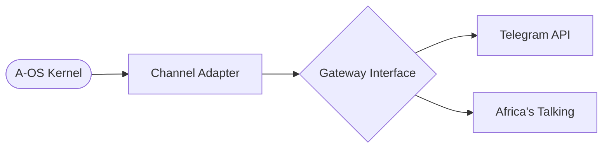

# Messaging Infrastructure & Channels (A-OS)

**Document Number**: 06  
**Status**: FAANG-Grade Architecture (Hardened)  
**Last Updated**: 2025-12-28

---

## 🌎 Executive Summary

Africa Offline OS (A-OS) provides a **Provider-Agnostic Messaging Kernel**. The system is designed to bridge the connectivity gap across Africa by unifying modern platforms (Telegram) with critical legacy/offline protocols (SMS, USSD) under a single architectural contract.

All channels leverage **E.164 Phone Normalization** for cross-border compatibility, ensuring that identities remain consistent regardless of the underlying transport.

---

## 🏗️ Architecture: The Gateway Pattern

To ensure kernel purity and high testability, every channel follows the **Gateway Isolation Pattern**.

### Structural Breakdown
1.  **Core Messaging Interface**: Standardized `ChannelAdapter` and `ChannelRequest` objects in `aos.core.channels.base`.
2.  **Gateways**: Isolated network logic (e.g., `TelegramGateway`, `AfricaTalkingGateway`). These handle raw HTTP/SDK calls.
3.  **Adapters**: Contextual conversational logic. They translate raw gateway payloads into A-OS `ChannelRequest` objects and route them to Domain Modules.



---

## 📂 Protocol Specifications

### 1. 🤖 Telegram (@aos_bot)
*   **Architecture**: Domain-Aware Single Bot.
*   **Routing**: Uses `DomainRouter` to dispatch commands based on the user's `active_domain`.
*   **Commands**: Core commands (`/start`, `/register`, `/domain`, `/profile`, `/help`) remain constant; contextual commands adapt dynamically.

### 2. 📱 Africa's Talking (SMS & USSD)
*   **SMS**: High-throughput asynchronous messaging. Supports multi-country shortcodes and alphanumeric IDs.
*   **USSD**: Stateless interaction protocol. A-OS manages session persistence via `USSDSessionManager`, allowing for complex multi-step menus on basic feature phones.
*   **Phone Normalization**: All incoming numbers are forced to E.164 via `normalize_phone()` to maintain identity integrity across borders ($07... \rightarrow +254...$).

---

## 🧪 Testing & Reliability

We follow a strict zero-bug mandate with a 100% test pass requirement for all messaging components.

### 1. Automated Verification
Run the integrated suite to verify all adapters, gateways, and rate limiters:
```bash
pytest aos/tests/test_channels/
```

### 2. Sandbox Simulation
For local development without external costs, use the integrated mocks or the AT Sandbox:
- **SMS Simulation**: `curl -X POST http://localhost:8000/api/channels/sms/webhook -d "from=+254712345678&text=HARVEST maize 10 A"`
- **USSD Simulation**: `curl -X POST http://localhost:8000/api/channels/ussd/webhook -d "sessionId=test_123&phoneNumber=+254712345678&text=&serviceCode=*384*123#"`

### 3. Mock Gateways
Use `MockSMSGateway` and `MockTelegramGateway` in `aos/adapters/mocks/` for purely offline unit testing.

---

## ✅ Compliance Standards
- **Kernel Purity**: No provider-specific SDKs (like `africastalking`) are imported into the kernel.
- **Async-First**: All messaging operations are non-blocking to ensure high availability on resource-constrained edge nodes.
- **Identity Integrity**: E.164 is the source of truth for all user identities.

---
*A-OS Messaging Technical Standard v2.0 | FAANG-Grade Reliability*
