# Enterprise Telegram Architecture (@aos_bot)

**Document Number**: 06  
**Status**: Architecture Refactored (Phase 5.11)  
**Date**: 2025-12-26

---

## Executive Summary

A-OS uses a **Domain-Aware Single Bot** architecture. Instead of multiple bots for different services, a unified `@aos_bot` acts as the entry point for all A-OS capabilities (Agriculture, Transport, Health, etc.). This ensures scalability, consistent UX, and centralized maintenance.

---

## 🏗️ Architecture: Domain-Aware Routing

### Context-Aware Command Flow

```mermaid
graph TD
    User([User]) -->|/start| Bot[Telegram Bot]
    Bot -->|Check Registration| Reg{Registered?}
    Reg -->|No| Flow[Registration Flow: Town, Roles]
    Reg -->|Yes| Sel[Domain Selector]
    
    Sel -->|Select Agri| Agri[🌾 Agriculture Domain]
    Sel -->|Select Transport| Trans[🚌 Transport Domain]
    
    Agri -->|/harvest| AH[Agri Handler]
    Trans -->|/book| TH[Transport Handler]
```



### Key Components

1.  **DomainRouter**: Orchestrates switching between domains.
2.  **Domain Modules**: Isolated logic for each vertical (Agri, Transport, etc.).
3.  **Universal User System**: Keeps track of `town`, `roles`, and `active_domain`.
4.  **State Machine**: Multi-step registration (Name → Phone → Town → Roles).

---

## 📂 Domain Structure

### 1. 🌾 Agriculture Domain
**Commands**: `/harvest`, `/sell`, `/buy`, `/prices`
**Focus**: Record keeping and marketplace participation.

### 2. 🚌 Transport Domain
**Commands**: `/routes`, `/book`, `/schedule`
**Focus**: Logistics and passenger mobility.

### 3. 🏥 Health Domain (Roadmap)
**Future Commands**: `/appointment`, `/records`, `/health_tips`

---

## ⌨️ Command Strategy

A-OS uses **Context-Specific Commands**. 
- User enters `/domain` to switch context.
- Commands like `/help` or `/harvest` adapt their behavior based on the *active domain*.
- **No Prefixes**: Instead of `/agri_harvest`, the user simply uses `/harvest` while in the Agri domain. This provides a cleaner interface.

---

## 🌎 Inclusivity: Town-Based Location

A-OS uses **Town** instead of "Village" for location tracking.
- **Why**: Many users live in peri-urban areas or cities but still need A-OS services. 
- **Universal**: Every resident in a rural or urban area has a nearest recognizable Town or City Center.

---

## 🛠️ Developer Setup

### 1. Bot Configuration
Update your `.env` with the token for `@aos_bot` (or your local test bot).

### 2. File Organization
- `aos/adapters/telegram.py`: Core interface.
- `aos/adapters/domain_router.py`: Command routing logic.
- `aos/adapters/domains/`: Vertical-specific handlers.

### 3. Commands (/setMyCommands)
Always set these as global core commands:
```text
start - Welcome screen
register - Join A-OS
domain - Change service domain
profile - View your account
help - Get help
```

---

## ✅ Compliance Checklist

### FAANG Standards
- ✅ **Single Responsibility**: Domains are isolated in modules.
- ✅ **Scalability**: New domains can be added by creating a new `BaseDomain` subclass.
- ✅ **Clean Code**: Context routing avoids bloated if/else chains in the main adapter.
- ✅ **User-Centric**: Town-based registration ensures no user is left out.

---

**Status**: 🚀 LIVE and Refactored  
**Next**: Implement Marketplace hooks in AgriDomain.
